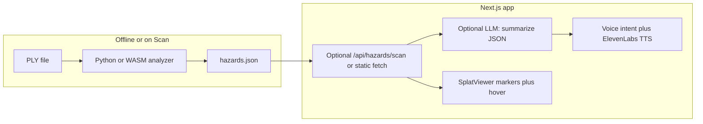

# PLY hazard scan, markers, and voice agent

## Reality check (so expectations match the data)

A single 3D Gaussian Splat `.ply` is a field of Gaussians (`x,y,z`, scales, rotation, opacity, SH color)—see parsing in `[frontend/public/splat/main.js](frontend/public/splat/main.js)` (`processPlyBuffer`). It does **not** contain semantic labels like “house” or “erosion.”

| Goal                      | Feasible from one PLY                                                                                                                  | Needs extra signal                                               |
| ------------------------- | -------------------------------------------------------------------------------------------------------------------------------------- | ---------------------------------------------------------------- |
| Tall structures           | Yes: height-field peaks / vertical clusters of high-opacity Gaussians                                                                  | —                                                                |
| “Floods first” / exposure | Yes: tie to existing flood plane Y in `[SplatViewer.tsx](frontend/components/SplatViewer.tsx)` (`computeWorldYBounds`, `uFloodLevelY`) | Calibrate “meters” vs scene units per location                   |
| Soil erosion              | Partial: terrain **roughness** (height gradient), **slope**, optional **color** heuristics (brown/orange) as weak proxies              | Ground truth or imagery for credibility                          |
| Building damage           | **Not reliable** from one splat alone                                                                                                  | Before/after PLY, or multi-view renders + vision model (phase 2) |

The plan below implements **strong geometric signals** first, labels damage as **explicitly heuristic or deferred**, and uses an **agent only on structured JSON** (positions, scores, categories)—not on megabytes of binary PLY.

## 1. Hazard analysis artifact (source of truth)

**Add a small analyzer** (recommended: Python + NumPy in `[3dgs/](3dgs/)` or `[scripts/](scripts/)`, mirroring header parsing in `processPlyBuffer`) that outputs one JSON file per location, e.g. `frontend/public/locations/maine_hazards.json` or served from storage.

**Suggested schema** (each item is one marker):

- `id`: `"A"` … `"Z"` (or stable string ids; UI maps to letters)
- `label`: short category (`tall_structure`, `flood_exposed`, `erosion_proxy`, …)
- `position`: `[x,y,z]` in **the same world space** as the Three.js PLY branch (must match transforms applied after PLY load in `[SplatViewer.tsx](frontend/components/SplatViewer.tsx)`—bounding box centering / rotation)
- `severity`: `0–1` or `low|medium|high`
- `metrics`: opaque numbers for the tooltip (e.g. `peakHeightM`, `gradient`, `belowFloodFraction`)
- `summary`: one-line template string **or** leave empty for LLM fill-in

**Detection ideas (implement as separate functions):**

- **Tall structures**: voxelize XY, take max Z per column; find local maxima above a percentile; cluster nearby peaks; rank by vertical extent × opacity mass.
- **Flood exposure**: reuse the same vertical axis as flood calibration; for each candidate region, estimate fraction of splat mass below `uFloodLevelY` at current scenario (or export multiple scenario keys in JSON).
- **Erosion proxy**: on a ground-dominated height map, high gradient magnitude + moderate slope + (optional) color stats from `f_dc_`* for “bare soil” hues—framed honestly as “possible erosion-prone terrain” in copy.

**Build workflow:** run the script when `output.ply` changes; commit JSON (or upload to blob + URL in `[frontend/lib/locations.ts](frontend/lib/locations.ts)`).

## 2. Viewer: A/B/C markers + hover (Three.js PLY path)

Extend `[SplatViewer.tsx](frontend/components/SplatViewer.tsx)` **for the PLY/Three path** (where `Points` + OrbitControls already exist):

- Load hazard JSON (URL from `LocationRecord` new field, e.g. `hazardsUrl?: string`).
- For each hazard: add a **world-space marker** (e.g. `CSS2DRenderer` labels “A”, “B”, … or `Sprite` + separate HTML overlay for rich tooltips).
- On hover: show `summary` + key `metrics` (and optionally “confidence: geometric proxy”).
- Optional: “focus hazard A” on the `[ViewerCommandApi](frontend/lib/viewer-types.ts)` so voice can move the camera toward `position`.

**Iframe splat renderer** (`[frontend/public/splat/main.js](frontend/public/splat/main.js)`): markers are harder (separate camera). Defer or implement a **minimal overlay** in the parent that tracks the same URL params / postMessage camera sync you already use—only if you must support `renderer: 'splat'` for the demo.

## 3. Voice: “Scan and mark hazards”

Extend `[frontend/lib/scene-command-catalog.ts](frontend/lib/scene-command-catalog.ts)` with phrases like “scan hazards”, “mark hazards”, “show risk areas”, mapping to a new intent (e.g. `scan_hazards`).

In `[LocationExperience.tsx](frontend/components/LocationExperience.tsx)`:

- On intent: ensure hazards JSON is loaded; set UI state “scan complete”; if markers were hidden, show them.
- Spoken summary: build from JSON (template string listing A–D + categories), then pass through existing ElevenLabs route `[frontend/app/api/voice/tts/route.ts](frontend/app/api/voice/tts/route.ts)` via `[useVoicePlayback](frontend/hooks/useVoicePlayback.ts)`—same pattern as other responses.

## 4. Agent / LLM (optional but matches “tell me what’s wrong”)

Add a **route** e.g. `app/api/hazards/narrate/route.ts` that:

- **Input:** structured hazard array (from JSON), user question optional.
- **Output:** `hoverTexts[]` and/or `spokenSummary` (short, cautious wording).

Use **the current nvidia NIM infra**

Call this route when: user runs scan, or on first hover (cached per session).

## 5. Phase 2 (if you need “house damage”)

- **Before/after PLY:** second analyzer pass: voxel-wise delta in density/opacity/color → “change hotspots.”
- **Vision:** render N views from Three.js → segmentation / VLM → back-project masks to 3D. Keeps “damage” credible.

## Implementation order

1. Python analyzer + JSON schema + one sample `*_hazards.json` for `[maine](frontend/lib/locations.ts)`.
2. `hazardsUrl` on `LocationRecord` + load in `SplatViewer` (PLY branch) + CSS2D or sprite markers + hover.
3. Voice intent + template spoken summary (ElevenLabs).
4. Optional `/api/hazards/narrate` for richer hover + voice copy.
5. Document limitations in UI copy (proxies vs confirmed damage).

