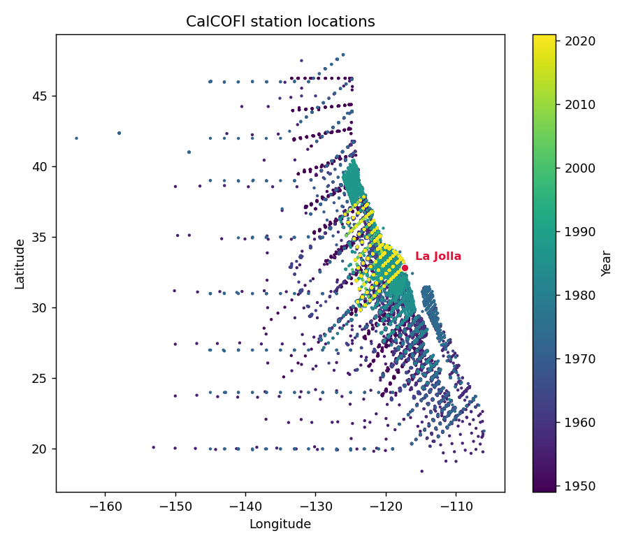
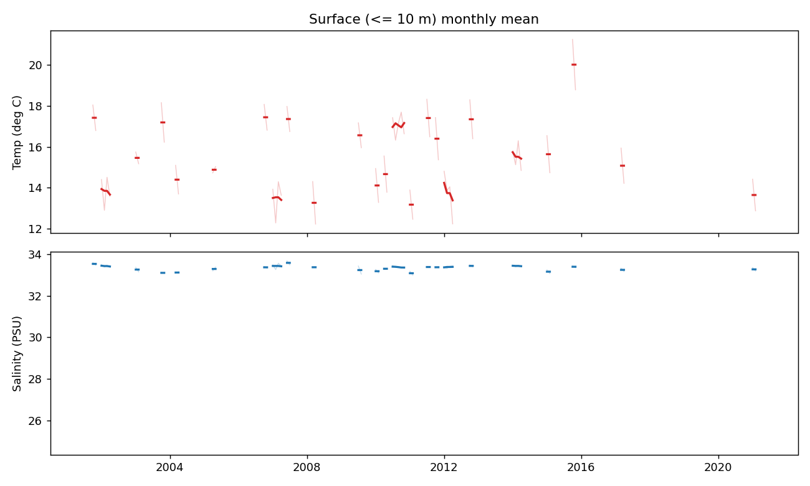
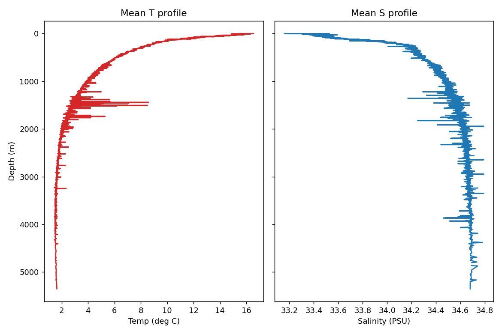
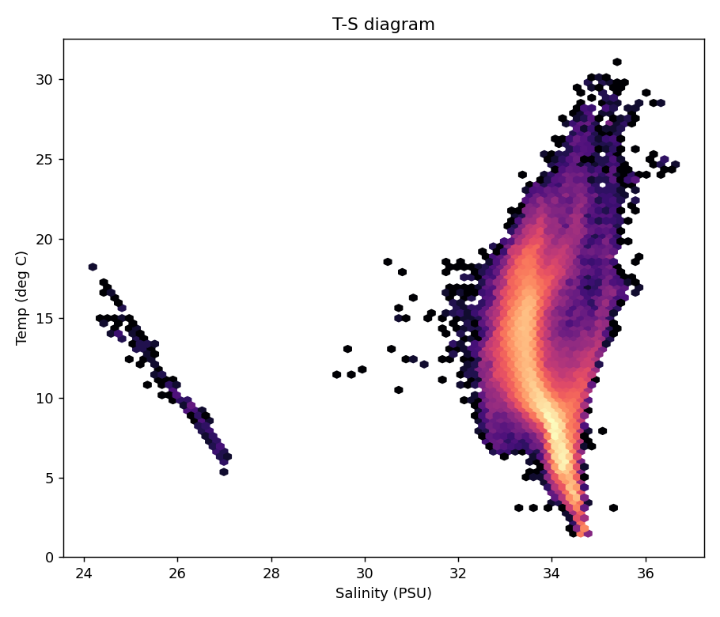
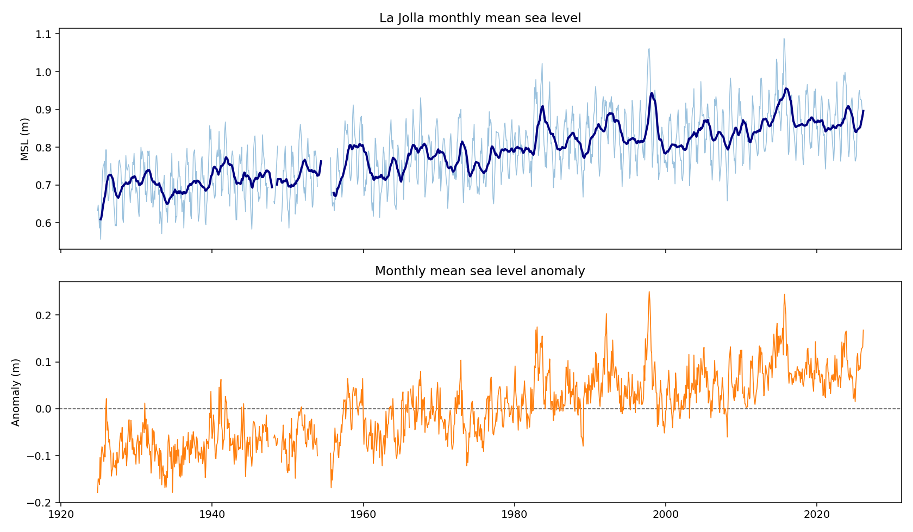
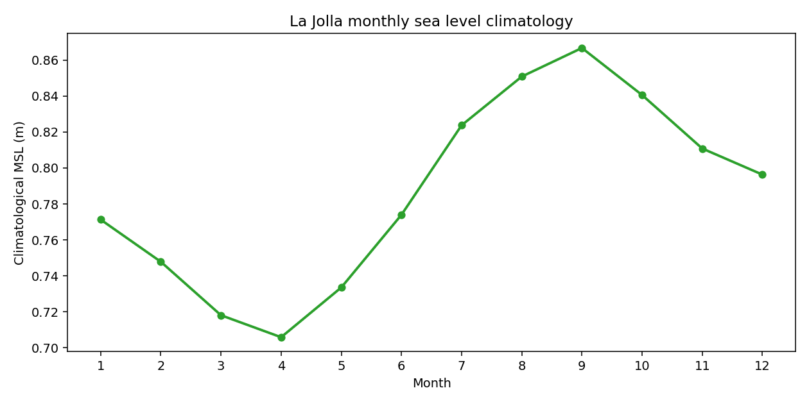
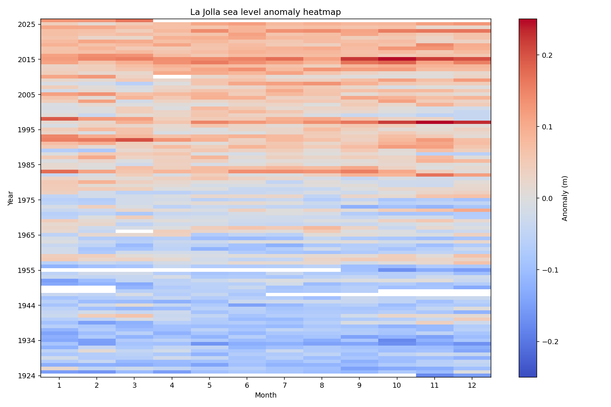
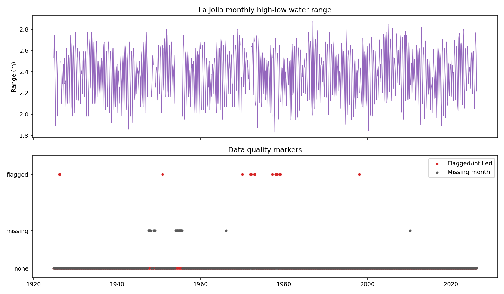
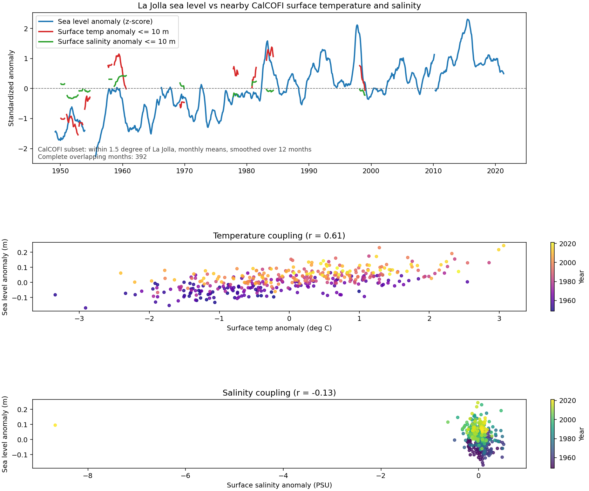
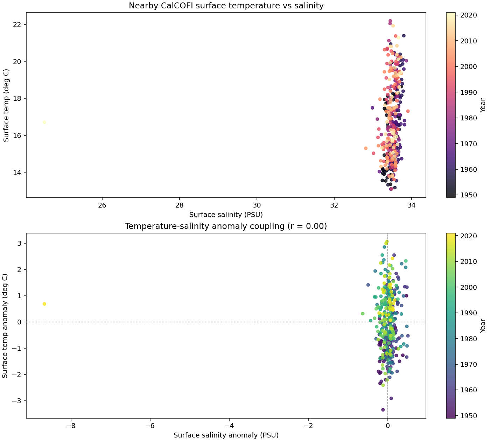

# Plot Write-Up

This directory contains exploratory figures for two linked data sources:

- NOAA CO-OPS station `9410230` at La Jolla
- CalCOFI hydrographic profiles aggregated from the 1949-2021 cast and bottle archive

The plots fall into three groups:

- `coops_*`: La Jolla monthly sea-level diagnostics
- `stations.png`, `surface_timeseries.png`, `depth_profiles.png`, `ts_diagram.png`: broad CalCOFI exploratory views
- `coops_calcofi_*`: local La Jolla and nearby CalCOFI coupling views used to motivate the feature engineering and backtests

## Data, Stations, and Features

### La Jolla CO-OPS station

- Station name: `La Jolla`
- Station id: `9410230`
- Coverage in the NetCDF used here: `1924-11` to `2026-03`
- Total monthly rows: `1217`
- Missing months: `35`
- Flagged or infilled months: `22`

Core CO-OPS variables used in the plots and models:

- `msl`: monthly mean sea level in meters
- `sea_level_anomaly`: monthly mean sea level minus the station's monthly climatology
- `highest`, `lowest`: monthly highest and lowest water level
- `monthly_range = highest - lowest`
- `msl_monthly_climatology`: mean sea level for each calendar month across the full record

### CalCOFI hydrography

- Profiles in the full NetCDF: `35,644`
- Depth levels: `3,219`
- Coverage: `1949-02-28` to `2021-05-13`
- Geographic extent: `18.417` to `47.917` N, `-164.083` to `-105.967` E/W convention
- Valid temperature values: `881,407`
- Valid salinity values: `845,033`

Core CalCOFI variables used in the plots and models:

- `Temp`: in `deg C`
- `Salinity`: in `PSU`
- Local surface features are built by:
  - keeping profiles within a chosen radius of La Jolla
  - averaging over the upper `10 m`
  - resampling to monthly means
  - converting to monthly anomalies:
    - `temp_anomaly`
    - `salinity_anomaly`
  - adding lagged versions at 1 and 3 months for the backtest:
    - `temp_anomaly_lag_1`, `temp_anomaly_lag_3`
    - `salinity_anomaly_lag_1`, `salinity_anomaly_lag_3`
- Sea-level persistence feature:
  - `persistence_1 = sea_level_anomaly.shift(1)`

For the local coupling plots, the CalCOFI subset is:

- Radius: `1.5` degrees from La Jolla
- Surface averaging depth: `<= 10 m`
- Complete overlapping monthly observations with sea level: `392`

## Figure-by-Figure Analysis

## `stations.png`

What it shows:

- The full CalCOFI station footprint, colored by year
- A broad offshore grid spanning much more than the La Jolla neighborhood
- Dense repeated sampling in Southern and Central California waters

How to read it:

- The red marker is La Jolla
- Purple points are older observations, yellow points are recent
- Sampling is not spatially uniform through time; nearshore Southern California coverage is much denser than the basin-scale fringe

Interpretation:

- This is an archive-wide map, not the local subset used in the final sea-level feature table
- The local modeling problem is therefore a small window cut from a much larger observing system
- The figure also explains why radius choice matters: expanding radius pulls in many more profiles quickly

Useful numbers:

- Full profile count: `35,644`
- Radius sweep profile counts:
  - `1.0 deg`: `2,440`
  - `1.5 deg`: `4,072`
  - `3.0 deg`: `10,332`
  - `5.0 deg`: `20,653`

## `surface_timeseries.png`

What it shows:

- Monthly mean CalCOFI surface temperature and salinity over the top `10 m`
- Only the last 20 years of the archive are shown
- The script preserves data gaps rather than drawing continuous lines across missing periods

Interpretation:

- The record is sparse in calendar time even late in the archive
- Surface temperature varies much more visibly than salinity
- Salinity stays in a narrow band around roughly `33.1` to `33.6 PSU`
- Temperature spans a much wider range, roughly `13` to `21 deg C`

Why it matters for modeling:

- Temperature has stronger dynamic range than salinity in the local surface layer
- Sparse monthly coverage means the joined La Jolla-CalCOFI training set is much smaller than the raw sea-level record

Important caveat:

- This figure comes from the full CalCOFI domain, not the 1.5 degree local subset
- It is useful for archive behavior, but not by itself evidence of local sea-level coupling

## `depth_profiles.png`

What it shows:

- Mean temperature and salinity profiles across the full CalCOFI archive
- Depth increases downward to about `5351 m`

Interpretation:

- Temperature declines strongly with depth, from about `16.5 deg C` near the surface toward `2 deg C` in the abyss
- Salinity increases from about `33.3 PSU` near the surface toward `34.6-34.8 PSU` at depth
- The thermocline is strong in the upper roughly `500-1000 m`
- The salinity profile is smoother, with more subtle structure than temperature

Why it matters:

- Your local features only use the top `10 m`, so this plot mostly provides oceanographic context
- It shows why a surface-only feature may miss deeper signals that could still influence coastal sea level

## `ts_diagram.png`

What it shows:

- A temperature-salinity hexbin diagram from the full archive
- The main water-mass cloud sits around `33-35.5 PSU` and `2-30 deg C`

Interpretation:

- The dense central plume is the expected Eastern Pacific water-mass structure
- A separate low-salinity branch appears near `24-27 PSU` and `6-18 deg C`
- That fresh branch is a minority population and is not representative of the tight local La Jolla surface cluster

Quality note:

- The full archive contains a small number of extreme values
- In the dataset summary there are `910` salinity values below `30 PSU` and `2` temperatures above `40 deg C`
- Those do not dominate the local models, but they are a reminder that broad-archive plots include rare or suspect points

## `coops_long_term_timeseries.png`

What it shows:

- Top: La Jolla monthly mean sea level with a 12-month rolling mean
- Bottom: sea-level anomaly relative to the monthly climatology

Key numbers:

- `msl` min/mean/max: `0.556 / 0.7866 / 1.088 m`
- anomaly min/max: `-0.1788 / +0.2502 m`

Interpretation:

- There is a clear long-term rise in mean sea level across the record
- The smoothed series rises from around `0.65-0.75 m` early in the century to around `0.85-0.95 m` recently
- The anomaly series is mostly negative in the early record and more frequently positive after the 1980s
- The largest positive anomaly episodes appear in the late 1990s and mid-2010s

Why it matters:

- This is the main motivation for anomaly-based modeling instead of raw `msl`
- Raw sea level contains both the seasonal cycle and long-term rise; anomalies isolate the month-to-month departures

## `coops_monthly_climatology.png`

What it shows:

- Average sea level for each calendar month at La Jolla

Key numbers:

- Minimum climatology month: `April`, `0.7059 m`
- Maximum climatology month: `September`, `0.8667 m`
- Seasonal amplitude from trough to peak: about `0.1608 m`

Interpretation:

- The seasonal cycle is strong
- Sea level tends to be lowest in spring and highest in late summer to early fall
- July through October sit well above January through May

Why it matters:

- Removing this cycle to form `sea_level_anomaly` is necessary before testing whether ocean-temperature and salinity anomalies add predictive skill

## `coops_anomaly_heatmap.png`

What it shows:

- A year-by-month heatmap of La Jolla sea-level anomaly
- Red is positive anomaly, blue is negative anomaly

Interpretation:

- The early decades are dominated by negative anomalies
- The record transitions toward more frequent positive anomalies after about the late 1970s and especially after the 1990s
- There are coherent positive years in the late 1990s and mid-2010s
- Seasonal structure remains visible inside some years, but the larger story is the shift from cooler-colored early decades to warmer-colored recent decades

Why it matters:

- This plot visually confirms that the anomaly series still contains low-frequency structure
- That helps explain why a one-step persistence term is already a strong baseline

## `coops_quality_and_extremes.png`

What it shows:

- Top: monthly high-low water range at La Jolla
- Bottom: month-level quality markers

Key numbers:

- Mean monthly range: `2.3931 m`
- 95th percentile monthly range: `2.7054 m`
- Missing months: `35`
- Flagged or infilled months: `22`

Interpretation:

- The tidal and subtidal monthly range is fairly stable over time, mostly around `2.0-2.8 m`
- Most quality issues are concentrated in older portions of the record, especially mid-century
- The modern record is comparatively complete

Why it matters:

- Data quality is not perfect, but the missing and flagged fraction is small relative to the full `1217` month record
- The much larger limitation for the joint modeling is CalCOFI sampling sparsity, not CO-OPS quality

## `coops_calcofi_joint_chart.png`

What it shows:

- Top: standardized smoothed anomalies for La Jolla sea level, nearby surface temperature, and nearby surface salinity
- Middle: scatter of sea-level anomaly vs surface temperature anomaly
- Bottom: scatter of sea-level anomaly vs surface salinity anomaly

Local subset definition:

- Radius: `1.5 deg`
- Surface average: `<= 10 m`
- Complete overlapping months: `392`
- Overlap window: `1949-02` to `2021-05`

Key numbers:

- `corr(sea_level_anomaly, temp_anomaly) = 0.6089`
- `corr(sea_level_anomaly, salinity_anomaly) = -0.1321`

Interpretation:

- Temperature is the only local ocean feature with a visibly strong linear relation to sea-level anomaly
- The temperature scatter has a clear positive slope and a broad but coherent cloud
- Salinity is weakly negative and visually much noisier
- In the top panel, temperature sometimes tracks multi-year sea-level swings, but salinity usually does not

Important caveat:

- The salinity anomaly scatter is stretched by a major outlier at `2021-05` with `salinity_anomaly = -8.6684 PSU`
- That point is paired with `temp_anomaly = +0.6839 deg C` and `sea_level_anomaly = +0.0954 m`
- It likely reflects sparse or unusual last-sample behavior and should probably be clipped or flagged in presentation plots

## `coops_calcofi_temp_salinity_coupling.png`

What it shows:

- Top: raw surface temperature vs raw surface salinity in the local 1.5 degree subset
- Bottom: temperature anomaly vs salinity anomaly in the same local subset

Key numbers:

- `corr(temp_anomaly, salinity_anomaly) = -0.0017`, effectively zero

Interpretation:

- Raw temperature and salinity occupy a tight local surface cluster around `33.3-33.8 PSU` and `13-22 deg C`
- After climatology removal, the anomaly cloud is almost vertical in salinity, with very little joint structure
- Temperature and salinity anomalies are therefore not behaving like a strongly coupled predictor pair in this local monthly setup

Why it matters:

- This helps explain why adding salinity on top of temperature gives little or no backtest benefit

## Modeling and Backtest Readout

The feature tests in `radius_sweep_backtest.py` compare:

- `persistence`
- `persistence_temp_now`
- `persistence_temp_salinity_now`
- `persistence_temp_lags`
- `persistence_temp_salinity_lags`

Backtest settings:

- `min_train_rows = 72`
- `test_window_rows = 12`
- `step_rows = 12`

Matched complete-case sample sizes by radius:

| Radius (deg) | Profiles | Shared rows | Folds |
| --- | ---: | ---: | ---: |
| 1.0 | 2440 | 124 | 4 |
| 1.5 | 4072 | 138 | 5 |
| 3.0 | 10332 | 166 | 7 |
| 5.0 | 20653 | 197 | 10 |

Best model by radius from the current run:

| Radius (deg) | Best model | Mean RMSE | Mean R2 |
| --- | --- | ---: | ---: |
| 1.0 | `persistence_temp_lags` | 0.0340 | 0.1547 |
| 1.5 | `persistence_temp_lags` | 0.0342 | 0.2316 |
| 3.0 | `persistence_temp_now` | 0.0341 | 0.3756 |
| 5.0 | `persistence` | 0.0341 | 0.3965 |

Incremental RMSE conclusions:

- Adding temperature to persistence is basically neutral:
  - `+0.0001`, `+0.0001`, `-0.0000`, `+0.0012` across the four radii
- Adding temperature lags to persistence is also basically neutral:
  - `-0.0005`, `-0.0001`, `+0.0001`, `+0.0013`
- Adding salinity on top of temperature is worse at every radius:
  - `+0.0009`, `+0.0013`, `+0.0001`, `+0.0005`
- Adding lagged salinity on top of lagged temperature is also worse at every radius:
  - `+0.0022`, `+0.0023`, `+0.0007`, `+0.0011`

Confidence-interval readout:

- The fold-level RMSE delta summaries all have 95% confidence intervals crossing zero
- That means there is no statistically clean evidence here that temperature or salinity beats persistence in a stable way
- The most defensible conclusion is:
  - persistence is the robust baseline
  - temperature is at best marginal
  - salinity does not add reliable skill in this setup

## Main Takeaways

- La Jolla sea level has a strong seasonal cycle and a clear long-term rise.
- The CO-OPS record is relatively complete; the joint modeling bottleneck is sparse CalCOFI overlap.
- Nearby surface temperature has a meaningful positive relationship with sea-level anomaly.
- Nearby surface salinity is weakly related to sea level and adds no consistent predictive value beyond temperature.
- Larger radii mostly help by increasing overlap counts and fold counts, not by producing materially better RMSE.
- For this dataset and these simple linear features, `persistence` remains the baseline to beat.

## Recommended Next Cleanup

- Clip or flag the extreme `2021-05` salinity anomaly before presenting the salinity scatter plots.
- Consider a robust local plot version with x-axis limits that do not let one salinity outlier dominate the figure.
- If the goal is forecasting rather than explanation, try strict calendar-contiguous monthly folds instead of row-based complete-case folds.

