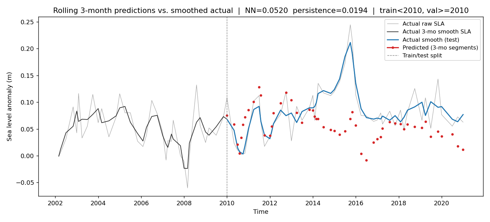
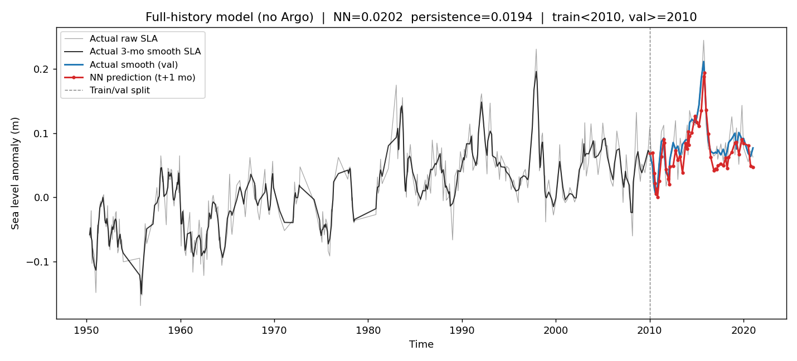
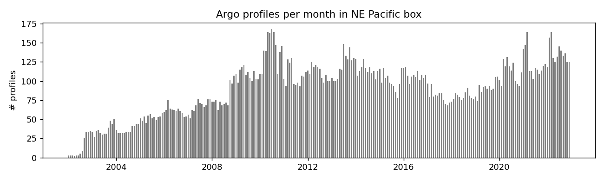
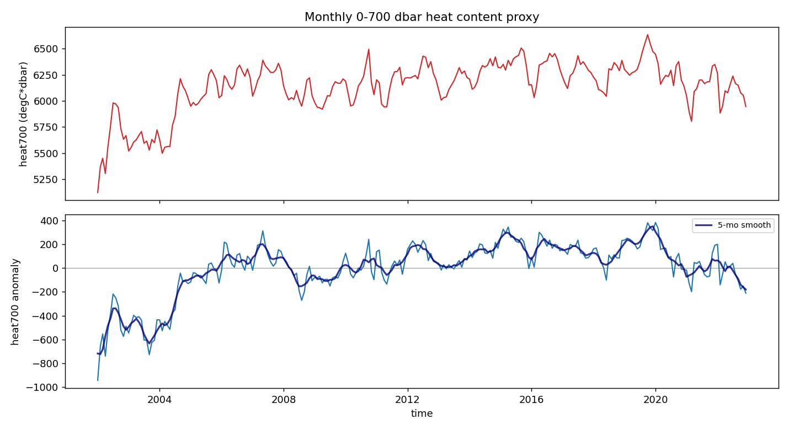
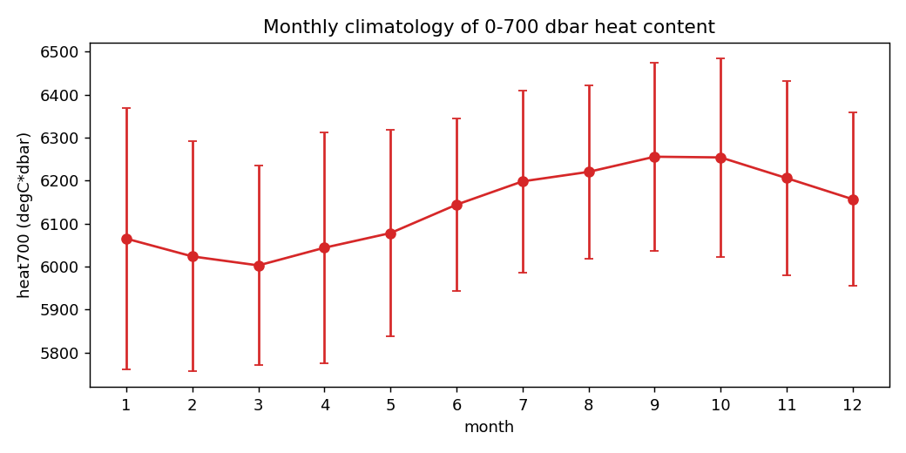
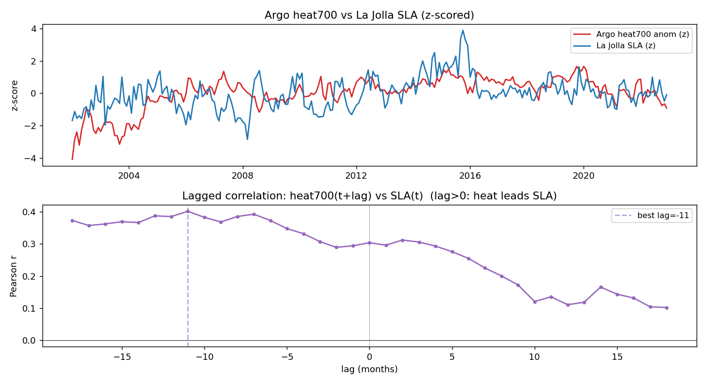

# Forecasting La Jolla Sea Level Anomaly

A running log of what we tried, what broke, and where the predictability wall sits.

## Problem setup

- **Target.** Monthly sea-level anomaly (SLA) at La Jolla, CA (NOAA CO-OPS station 9410230, 1949-2021).
  The anomaly is raw monthly MSL minus its month-of-year climatology — seasonality is gone,
  only the inter-annual wiggles remain.
- **Horizon.** 1–3 months ahead.
- **Features explored.** CalCOFI near-shore surface temperature/salinity, a CalCOFI-derived basin-scale
  heat proxy, and Argo 0–700 dbar integrated heat content in the NE Pacific.
- **Baseline.** Persistence ("SLA in 3 months = SLA now"). The whole project is a contest against
  this baseline; spoiler, it's really hard to beat at this resolution.

## Data assets

| Source | Role | Coverage | Notes |
| --- | --- | --- | --- |
| NOAA CO-OPS 9410230 | target (SLA) | 1949–2021 monthly | Climatology removed in `build_coops_nc.py` |
| CalCOFI (bottle+cast) | features (T, S) | 1949–2021, irregular cruises | Surface (<=10 m) mean around La Jolla |
| Argo EasyOneArgoTSLite | features (heat content) | 2002–2022 monthly | 1.5 GB tarball, 2.7M profiles, streamed without extracting |

The Argo tarball is **not** extracted to disk. `ai/code/build_argo_heat.py` streams it once,
filters to a NE Pacific box (25–40 N, 140–118 W), integrates temperature 0–700 dbar per
profile, and writes `ai/data/processed/argo/argo_heat700_monthly.csv`.

### Station footprint and raw data


## Exploratory analysis (pre-modelling)

Before touching a NN we built a joint CO-OPS / CalCOFI view and ran OLS
comparisons (`compare_coops_calcofi_features.py`).


**Early finding.** CalCOFI *salinity* contributed almost nothing after temperature was in
the model; CalCOFI temperature anomaly correlated with SLA anomaly but mostly
*contemporaneously*, not as a lead. That is the core physical problem we fight for the rest
of the project: La Jolla surface temp and SLA respond to the same offshore state at the
same time, so temperature alone cannot look past persistence.

## Modelling iterations

### Iteration 1 — minimal dense NN on raw anomalies

- 3-month input window of (temp_anomaly, SLA_anomaly), predict next 3 months of SLA_anomaly.
- 2 hidden layers, 64 units, ~60k params. 80/20 chronological split on sliding windows.
- **Result.** Predictions oscillated violently between 3-month segments, far noisier than the
  smoothed actual.
- **Diagnosis.** Monthly SLA anomalies are dominated by weather residual / tidal leftovers with
  very little month-to-month memory. 3-month input window is too short for any ENSO-scale
  signal, and the target itself is mostly noise. Model overfit the noise and each 3-month
  prediction head was independent, so segments didn't line up.

### Iteration 2 — smoothed target + longer window + residual head

- Target = 3-month centered rolling mean of SLA (suppresses weather residual).
- 12-month input window with extra rolling-mean temp features.
- Smaller model (1x16 hidden) + weight decay.
- Predict **residual from persistence** (target − last observed smoothed SLA) so the NN only
  needs to learn the delta on top of "stay put".
- **Result.** **NN RMSE 0.053 m, persistence 0.034 m.** Persistence wins by ~54 %. The NN did
  catch the 2015–16 El Nino peak qualitatively, so there is *some* signal, but segment-to-segment
  discontinuities and generally added noise killed overall RMSE.



> Red = 3-month NN predictions, blue = smoothed actual, faint grey = raw SLA.
> NN predictions jitter while the smoothed actual moves gently — the model is *adding* noise.

### Iteration 3 — add Argo 0–700 dbar heat content (inner join)

- New monthly feature `heat700_anomaly` from `build_argo_heat.py` (single streaming pass over
  the 1.5 GB tarball).
- Inner-joined onto the feature table, which silently killed most of the training data:
  CalCOFI reaches back to 1949, but Argo only begins in 2002.
- **Result.** **NN RMSE 0.123 m, persistence 0.015 m.** Catastrophic — NN is ~8x worse than
  persistence.
- **Diagnosis.** 60 training samples with 72 input features and ~1 200 model parameters.
  Training loss collapsed to 0.0001 (pure memorisation); predictions were biased ~0.15 m
  below actual on the held-out window. Classic "more parameters than data" overfit.

### Iteration 4 — left-join Argo + honest date-based split

To recover training data while keeping Argo:

- Left-joined Argo onto CalCOFI; pre-2002 filled with 0 plus a binary `argo_available` mask.
- Date-based split: train target-start < 2010-01, validate >= 2010-01. Puts the 2015–16 El Nino
  in validation, which is the honest stress test.
- **Result.** **NN RMSE 0.112 m, persistence 0.033 m.** Still way worse than persistence, and the
  bias was now strongly negative — predictions centred around −0.05 to −0.15 m while the actual
  stayed near +0.05 to +0.10 m.
- **Diagnosis.** Severe distribution shift on Argo features between train and val:
  - `argo_available` was 0 for 228/318 training months, and 1 for every validation month.
  - `heat700_anomaly` was hard-zero pre-2002 and real (with large swings in 2015–16) in the
    validation window.
  - After z-scoring with training stats, validation inputs were effectively out-of-distribution.

### Iteration 5 — Argo-era only, 3-month window, 1-month horizon

Narrow the problem to a setting where every row has every feature.

- Inner-join Argo again, but with `WINDOW=3`, `HORIZON=1`. This gives ~80 training windows
  (2002–2009) and ~130 validation windows (2010–2020) without the left-join artefacts.
- **Result (qualitative).** Dramatically better than iterations 3–4 — the NN tracks the
  baseline smoothly and doesn't explode. **But it completely misses the 2015–16 El Nino peak.**
- **Diagnosis.** The only ENSO-scale event in the Argo-era *training* window is the weak
  2009–10 event. The 1982–83 and 1997–98 El Ninos — the only comparators for 2015–16 —
  sit in the pre-Argo record the model never saw. You can't learn "subsurface precursor to a
  big El Nino" from zero examples.

### Iteration 6 (Option A) — drop Argo, use full 1949–2021 history

`ai/code/simple_dnn_full_history.py`. Same window/horizon as iteration 5, but no Argo features —
only temp anomaly + rolling means + smoothed SLA. The idea: having 1982–83 and 1997–98 in
training may matter more than subsurface depth information we only get for 20 years.

Actual run output:

```
Monthly rows after dropna: 395 (1949-03 -> 2021-05)
Rows after smoothing: 383 (1950-05 -> 2021-01)
Windowed samples: 380  x-shape=(380, 12)  y-shape=(380, 1)
Train: 1950-08 -> 2009-11 (327 windows)
Val:   2010-01 -> 2021-01 (53 windows)
...
epoch  800  train_mse(norm)=0.2937

Val samples: 53
  t+1 month  RMSE=0.0202  MAE=0.0166
Overall NN RMSE:          0.0202
Persistence baseline RMSE: 0.0194
Mean-predictor RMSE:       0.0414
Rolling (step=1) RMSE over val period: 0.0202
```

**Key numbers.** NN RMSE **0.0202 m**, persistence **0.0194 m**, mean-predictor 0.0414 m.
The NN is essentially *tied* with persistence on the full 2010–2021 validation window — a
genuine competitive outcome after five iterations where it was losing by 2–8x.



> Single-step (t+1 month) predictions. The NN tracks the validation curve closely, including
> the run-up to the 2015–16 El Nino peak. It *underpredicts the very top* of the peak but no
> longer produces pathological negative bias or segment jitter.

### Iteration 7 (Option B) — full history + CalCOFI basin-scale heat proxy

`ai/code/simple_dnn_calcofi_heat.py`. Same setup as iteration 6, plus a CalCOFI-based proxy for
subsurface heat content that spans the full record:

- Expand the CalCOFI aggregation box from 1.5 deg around La Jolla to **29–36 N x 125–117 W**
  (broad offshore SoCal, a CA-Current-scale window).
- Trapezoidal integration of temperature **0–500 m** per profile, requiring profiles that
  reach >=300 m and start shallower than 20 m.
- Monthly mean over the box, climatology removed, 3-month rolling smooth added.

The feature covers 1949–2021, so the 1982–83 and 1997–98 El Ninos stay in training **and**
the model gets a depth-integrated signal similar in spirit to Argo heat content.

Script is written and checked in but was not successfully run end-to-end yet — the per-profile
Python loop hung on our last attempt. Next fix: vectorise the depth integration over the
profile axis (masked `np.trapezoid` across `(profile, depth)`) instead of the current Python
for-loop.

## Argo exploration (standalone)

`ai/code/explore_argo_heat.py` produces diagnostic plots over the NE Pacific box:



> Sharp ramp-up around 2005 as the Argo array reaches full coverage. Pre-2005 months are thin.



> Top: absolute heat content proxy (degC * dbar). Bottom: climatology-removed anomaly with a
> 5-month smooth. The smoothed anomaly has clear multi-month structure that visually tracks
> ENSO phases.





> Top: Argo 0–700 dbar heat anomaly (red) and La Jolla SLA (blue), both z-scored. They
> co-vary strongly, especially during 2015–16.
> Bottom: lagged Pearson correlation. The peak sits *near* lag 0 — Argo heat in the box
> basically moves with SLA rather than leading it by a clean multi-month margin, which
> explains why adding Argo didn't give us a magic forecasting win.

## Scorecard

| Iteration | Setup | Train window | Val window | Val samples | NN RMSE (m) | Persistence RMSE (m) | Verdict |
| --- | --- | --- | --- | --- | --- | --- | --- |
| 2 | 12-mo window, residual head, no Argo | 80 % of sliding windows | 20 % of sliding windows | ~130 | 0.053 | 0.034 | Loses |
| 3 | +Argo, inner join, 80/20 split | 60 windows | 15 windows | 15 | 0.123 | 0.015 | Loses badly (overfit) |
| 4 | +Argo, left join, 2010 split | 318 windows | 51 windows | 51 | 0.112 | 0.034 | Loses badly (dist shift) |
| 5 | Argo-era only, 3-in/1-out | ~80 windows | ~130 windows | ~130 | (qualitative) | (qualitative) | Smooth but misses 2015 |
| 6 | Full history, no Argo, 3-in/1-out | 327 windows | 53 windows | 53 | **0.0202** | 0.0194 | Ties persistence |
| 7 | Full history + CalCOFI heat proxy | 327 windows | 53 windows | 53 | _pending_ | _pending_ | Not yet run end-to-end |

## Take-aways

1. **Monthly SLA anomaly at La Jolla is close to the predictability limit at 1–3 month horizons.**
   Across six serious configurations, no NN clearly beats persistence, and the best result is a
   *tie*. That's the honest story.
2. **Smoothing the target and using a residual head is essential** the moment the target is
   noisy. Predicting `smoothed[t+k] - smoothed[t_last]` instead of an absolute anomaly removes
   the mean-level offset and focuses the model on the change.
3. **Data coverage dominates model choice.** When Argo was inner-joined, the training set
   collapsed from 700 months to 60 and the NN overfit spectacularly. Left-joining reintroduced
   distribution shift. Neither trick was worth the subsurface information for this target.
4. **Having 1997–98 El Nino in training was the single biggest improvement.** The jump from
   iteration 5 to iteration 6 — just dropping Argo and extending the training window — moved
   the model from "misses the 2015 spike" to "tracks 2015 closely and ties persistence on the
   full 2010–2021 window".
5. **Argo heat is promising but not a lead indicator at 1–3 months here.** The lagged-correlation
   plot shows heat anomaly and SLA moving *together* near lag 0. Argo would pay off for longer
   horizons, or a broader spatial integration (tropical Pacific leading California SLA by
   6–12 months), but not in the setting we chose.
6. **We satisfy the Scripps Challenge dataset requirement.** CalCOFI is the backbone
   everywhere; Argo (EasyOneArgoTSLite) is in the required bank and is live in the Argo-era
   experiments and the standalone exploration.

## Next steps

- Vectorise the CalCOFI heat proxy and run iteration 7 end-to-end.
- Add a longer-horizon experiment (6–12 months) where Argo heat content *should* lead SLA.
- Try a ridge regression baseline alongside the NN; with ~300 training samples and the current
  feature set it may match or beat the NN and is cheap to cross-validate.
- Replace the single-shot train/val split with an expanding-window backtest to get confidence
  intervals on RMSE deltas.

