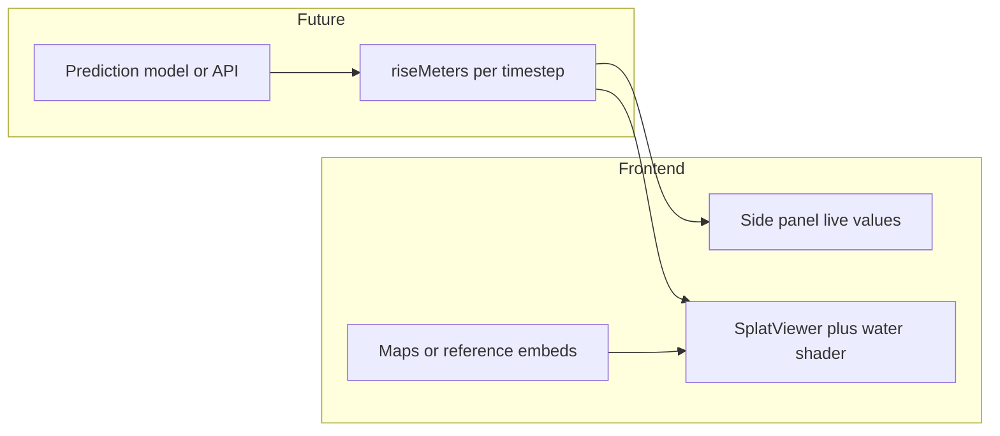

# Sojs — Frontend

## Purpose

Sojs is the demo UI for a sea-level rise storytelling experience: a **3D scene viewport**, a **time/timeline** control, and panels for metrics and attribution. The long-term goal is to drive flood height and narrative from a **real prediction pipeline**; today several pieces are **UI scaffolding** with static or placeholder data.

---

## Stack

| Layer | Choice |
|--------|--------|
| Framework | **Next.js 16** (App Router) |
| UI | **React 19**, **TypeScript** |
| 3D | **Three.js**, **PLYLoader**, optional local splat viewer fallback |
| Styling | **Tailwind CSS v4** (imported in `app/globals.css`); most of the shell uses **custom CSS** classes in `globals.css` |

Build notes: `.ply` assets are rendered directly in the client with Three.js. `.splat` assets still fall back to the local `public/splat` viewer when needed.

---

## Current behavior (as implemented)

- **`SplatViewer`** (`components/SplatViewer.tsx`): Client-only viewer that loads `.ply` assets directly with Three.js + `PLYLoader`, fits the camera to the point cloud, and falls back to the local splat iframe only for `.splat` assets.
- **`page.tsx`**: Defines a discrete **`TIMELINE`** (years ~2025–2125 with associated **`rise`** in meters). A **range input** and **year buttons** set the active index.
- **Water representation**: A **CSS** `.water-overlay` at the bottom of the viewport whose **height** is derived from `scene.rise` (not a water mesh inside the 3D scene). A subtle animated “surface” line is CSS-only.
- **Stats panel**: Shows sea-level rise (+m), year, and scenario label for the active timeline step.
- **Attribution panel**: Lists placeholder source names (e.g. NASA, Gulf, NOAA-style labels); not yet wired to live dataset metadata.
- **Header nav** (“3D VIEW”, “DATA”, “ABOUT”): **Visual only** — no separate routes or panels yet.

**Honest gap:** Rise values are **hardcoded** in `TIMELINE`. There is no backend, no model API, and no map/inundation layer in the bundle yet.

---

## Overall plan (project)

The end-to-end project phases live in the repo root: **[`../PLAN.md`](../PLAN.md)** (source of truth). In short:

1. **3D world** — Photogrammetry / splat (or equivalent) for a real location.
2. **Prediction model** — Features from climate/ocean datasets; output relative sea-level rise over horizons (e.g. 10–100 years).
3. **Water / flooding visualization** — Map predicted rise to visible flood level in the 3D view.
4. **Integration** — Model output ↔ visualization; time scrubbing; dataset attributions.

The frontend today is an **early shell** aligned with phase 4 *intent* (scrub time, show rise) but not yet connected to the trained model.

---

## Roadmap / product notes

### Before/after split-screen or time slider

- **Target UX:** Either a **split view** (dry vs flooded at the same camera) or a **single view** with a **time/rise slider** (current direction: bottom timeline + slider).
- **Presets:** Configure explicit scenarios (e.g. **+0.5 m, +1 m, +2 m**) and tie them to years such as **2050** and **2126** as needed for narrative. These should be **data-driven** (config or API), not only ad hoc constants in one component.
- **Single source of truth:** The same **`riseMeters` (and year)** signal should eventually drive **CSS overlay**, any **shader water height**, and **labels** so the UI stays consistent.

### Water animation (refraction, reflection, flow)

- **Today:** Bottom **CSS gradient** + animation — fast to iterate, not physically accurate.
- **Next:** A **Three.js** water surface (plane or limited mesh) with **shaders** for refraction/reflection and optional **flow** around static geometry — or a **React Three Fiber** stack if the team standardizes on R3F. This is a **separate milestone** from the 2D overlay prototype.

### Real data layers (credibility)

- Overlay or side-by-side **NOAA** or **Climate Central** (or similar) **inundation** or **photo simulation** products so viewers can compare “our model + 3D scene” with **established map products**.
- Plan for **attribution**, **terms of use**, and **tile/API limits** where applicable.

### Interactive storytelling

- **Floating labels** in screen space or 3D anchors, e.g. *“Model predicts X m here (trained on Y)”*, plus **risk zones** (color bands or hulls).
- **Particles** for **waves/foam** — options: lightweight **CSS/canvas** near the water line vs **GPU instancing** in Three for heavier effects.

### Fallback visuals

- If the 3D asset fails to load or for **comparison mode**, embed **NOAA Sea Level Rise Viewer** or **Climate Central** interactive maps (or **screenshots** with fixed camera) as **background/reference**, clearly labeled so judges know what is **reference** vs **team model**.

### Live model output (side panel)

- **Target:** A **side panel** showing the **running model** (even a simple regression/extrapolation) with **live or polled** outputs feeding the 3D scene.
- **Suggested contract** (future API or server action):

  ```ts
  // Illustrative — not implemented yet
  type SeaLevelFrame = {
    year: number;
    riseMeters: number;
    confidence?: number;
    sourceLabel?: string; // e.g. training dataset id
  };
  ```

- **Today:** The right-hand stats panel reflects **`TIMELINE[idx]`** only — swap this for **`fetch`/SSE** when the model is available.

---

## Target data flow (future)



---

## Open questions

- When to **replace** the CSS water overlay with a **shader-based** water plane without blocking demo stability.
- **Split-screen:** one shared camera vs two synchronized views; performance impact on splat sorting.
- **Embeds:** iframe **CORS**, allowed domains, and whether **static screenshots** are safer for hackathon demos than live embeds.
- How to **validate** UI flood height against both **model output** and **external map layers** without confusing users (legend + explicit “layer” toggles).

---

## Related files

| File | Role |
|------|------|
| [`app/page.tsx`](app/page.tsx) | Timeline, overlay height, layout |
| [`components/SplatViewer.tsx`](components/SplatViewer.tsx) | PLY point-cloud viewer with splat fallback |
| [`app/globals.css`](app/globals.css) | App shell, water overlay, panels |
| [`../PLAN.md`](../PLAN.md) | Full project phases |
